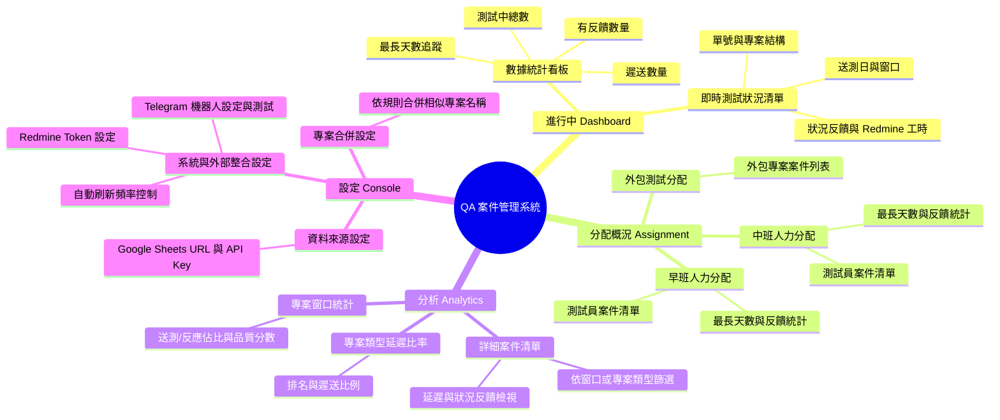

# QA 案件管理系統架構與功能

## 主要功能 (Features)
1. **案件總覽與追蹤 (Dashboard)**
   - 讀取 Google Sheets 上的案件資料。
   - 分類顯示早班、中班、外包的案件分配狀況，處理「無窗口」等極端值狀態。
   - 自動計算各案件的送測天數，高亮顯示最長天數及判定遲交案件。
2. **數據分析 (Analytics)**
   - 依據「月份」篩選案件歷史數據。
   - 統計各專案窗口的處理總件數、反饋數、延遲數量及品質分數。
   - 統計各專案類型的案件延遲比例，並支援自訂規則合併專案名稱。
3. **即時通知 (Notifications)**
   - 串接 Telegram Bot API。
   - 輪詢比對資料快照，當有「新增任務」或「測試狀況/遲送狀態異動」時，自動推播通知給指定群組。
4. **外部系統整合 (Integrations)**
   - **Google Sheets API/Gviz**: 系統的核心資料來源（支援 Public/API Key 模式）。
   - **Redmine API**: 撈取進行中的 Ticket ID，透過 CORS Proxy 動態爬取 Issue 的工時資訊 (Spent/Estimated hours)。
5. **系統設定 (Settings)**
   - 管理 Google Sheets URL、Telegram Token/Chat ID、Redmine Token，以及專案資料合併規則設定。

## 系統架構圖 (Architecture)

```mermaid
graph TD
    %% 外部依賴
    subgraph External APIs
        GS[Google Sheets API / Gviz<br/>系統資料庫/案件來源]
        RM[Redmine API<br/>Ticket 工時擷取]
        TG[Telegram Bot API<br/>即時事件推播通知]
    end

    %% 前端應用
    subgraph Frontend Application (React SPA in index.html)
        State[State Management<br/>React Hooks: useState, useMemo]
        
        subgraph UI Modules
            Dash[Dashboard 模組<br/>案件總覽 / 分配概況]
            Analyt[Analytics 模組<br/>月度數據 / 窗口品質分析]
            Sett[Settings 模組<br/>Token / 規則管理]
        end
        
        Logic[Business Logic<br/>src/utils.js 純函式]
    end

    %% 測試層
    subgraph Tooling Layer
        Vitest[Vitest 測試框架<br/>src/utils.test.js]
    end

    %% 資料流與操作關聯
    GS -->|Fetch Data (Polling)| State
    RM -->|透過 3rd-party CORS Proxy 取得工時| State
    State -->|資料差異比對觸發| TG
    State <--> UI Modules
    UI Modules -.-> Logic
    Logic -.-> Vitest
```

## 技術堆疊
- **核心框架**: React 18 (透過 Import Maps 與 CDN 載入), Babel Standalone (瀏覽器端即時 JSX 編譯)。
- **樣式與 UI**: Tailwind CSS (CDN), Lucide React (圖示)。
- **部署架構**: 輕量化單一 `index.html` 執行，無需 Node.js 建置 (Build) 過程即可在瀏覽器運作。
- **測試框架**: Vitest 負責 `src/` 底下抽離的純粹業務邏輯（日期運算、字串比對）的單元測試。

## 資訊架構圖 (Information Architecture)


